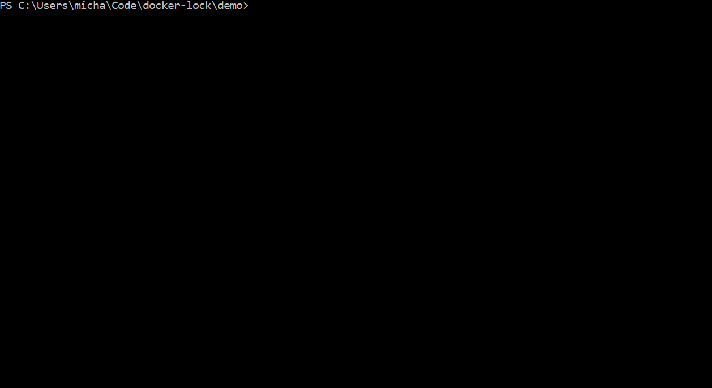
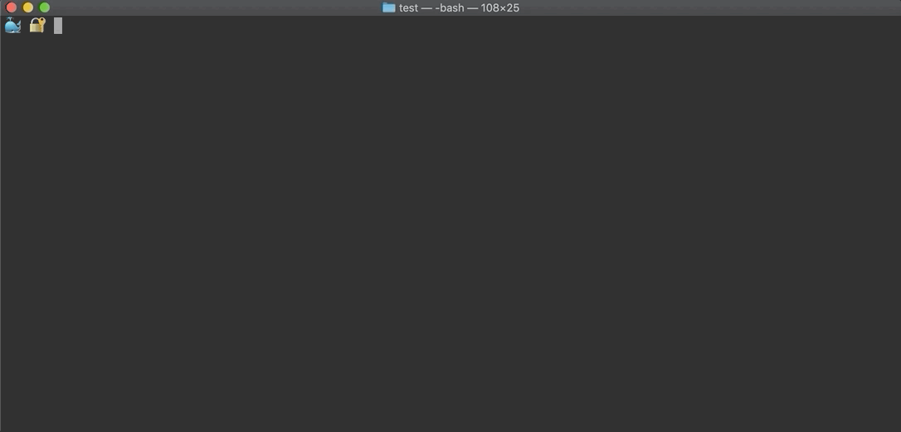

# About
[](https://goreportcard.com/report/github.com/safe-waters/docker-lock)
[](https://dev.azure.com/michaelsethperel/docker-lock/_build?definitionId=4&branchName=master)
[](https://pkg.go.dev/github.com/safe-waters/docker-lock)

`docker-lock` is a cli tool that automates managing image digests by tracking
them in a separate Lockfile (think package-lock.json or Pipfile.lock). With
`docker-lock`, you can refer to images in Dockerfiles or 
docker-compose files by mutable tags (as in `python:3.6`) yet receive the same 
benefits as if you had specified immutable digests (as in `python:3.6@sha256:25a189a536ae4d7c77dd5d0929da73057b85555d6b6f8a66bfbcc1a7a7de094b`).

> Note: If you are unsure about the differences between tags and digests,
refer to this [quick summary](./docs/tutorials/tags-vs-digests.md).

`docker-lock` ships with 3 commands that take you from development 
to production:

* `docker lock generate` finds base images in your Dockerfiles and docker-compose
files and generates a Lockfile containing digests that correspond to their tags.
* `docker lock verify` lets you know if there are more recent digests 
than those last recorded in the Lockfile.
* `docker lock rewrite` rewrites Dockerfiles and docker-compose files 
to include digests.

`docker-lock` ships with support for [Docker Hub](https://hub.docker.com/),
[Azure Container Registry](https://azure.microsoft.com/en-us/services/container-registry/),
[internal registries](https://docs.docker.com/registry/deploying/),
and a variety of other registries. If your registry is not supported
out of the box, do not worry. `docker-lock` was designed to be
[easily extensible](./docs/tutorials/bring-your-own-registry.md) to any
container registry.

`docker-lock` is most commonly used as a
[cli-plugin](https://github.com/docker/cli/issues/1534) for `docker` so `lock`
can be used as subcommand of `docker` as in `docker lock`. However,
`docker-lock` does not require `docker` at all. Instead, it can be called
manually as in `docker-lock lock`. This is especially convenient if the proper
version of `docker` is unavailable or you would prefer to use another
container technology such as [podman](https://podman.io/).

# Demo
Consider a project with a multi-stage build Dockerfile at its root:
```
FROM ubuntu AS base
# ...
FROM mperel/log:v1
# ...
FROM python:3.6
# ...
```
Running `docker lock generate` from the root queries each images' 
registry to produce a Lockfile, `docker-lock.json`.



Note that the Lockfile records image digests so you do not have to 
manually specify them.

Running `docker lock verify` ensures that the image digests are the 
same as those on the registry for the same tags.



Now, assume that a change to `mperel/log:v1` has been pushed to the registry.

Running `docker lock verify` shows that the image digest in the Lockfile 
is out-of-date because it differs from the newer image's digest on the registry.


While developing, it can be useful to generate a Lockfile, commit it to 
source control, and verify it periodically (for instance on PR merges). In 
this way, developers can be notified when images change, and if a bug related 
to a change in an image crops up, it will be easy to identify.

Finally, lets assume the Dockerfile is ready to be built and shared.

Running `docker lock rewrite` will add digests from the Lockfile 
to all of the images.


At this point, the Dockerfile will contain all of the digest information 
from the Lockfile, so it will always maintain the same, known behavior 
in the future.

# Install
`docker-lock` can be installed as a
[cli-plugin](https://github.com/docker/cli/issues/1534) for `docker` or as a
standalone tool.

## Cli-plugin
Ensure `docker` cli version >= 19.03 is installed by running `docker --version`.

### Linux / Mac
* `mkdir -p ~/.docker/cli-plugins`
* `curl -fsSL https://github.com/safe-waters/docker-lock/releases/download/{VERSION}/docker-lock-{OS} -o ~/.docker/cli-plugins/docker-lock`
* `chmod +x ~/.docker/cli-plugins/docker-lock`
### Windows
* Create the folder `%USERPROFILE%\.docker\cli-plugins`
* Download `docker-lock-windows.exe` from the releases page.
* Rename the file `docker-lock.exe`
* Move `docker-lock.exe` into `%USERPROFILE%\.docker\cli-plugins`

## Standalone tool
* Follow the same instructions as in the
[cli-plugin section](#cli-plugin) except place the `docker-lock` executable in
your `PATH`.
* To use `docker-lock`, replace any `docker` command such as `docker lock` with
the name of the executable, `docker-lock`, as in `docker-lock lock`.

# Documentation
## Tutorials
* [Command Line Flags/Configuration File](./docs/tutorials/command-line-flags-configuration-file.md)
* [Using Internal Registries](./docs/tutorials/internal-registry.md)
* [Bring Your Own Registry](./docs/tutorials/bring-your-own-registry.md)
* [Tags Vs. Digests](./docs/tutorials/tags-vs-digests.md)

## Contributing
* [Development Environment](./docs/contributing/development-environment.md)
* [Code Quality](./docs/contributing/code-quality.md)
* [Go.dev](https://pkg.go.dev/github.com/safe-waters/docker-lock)
