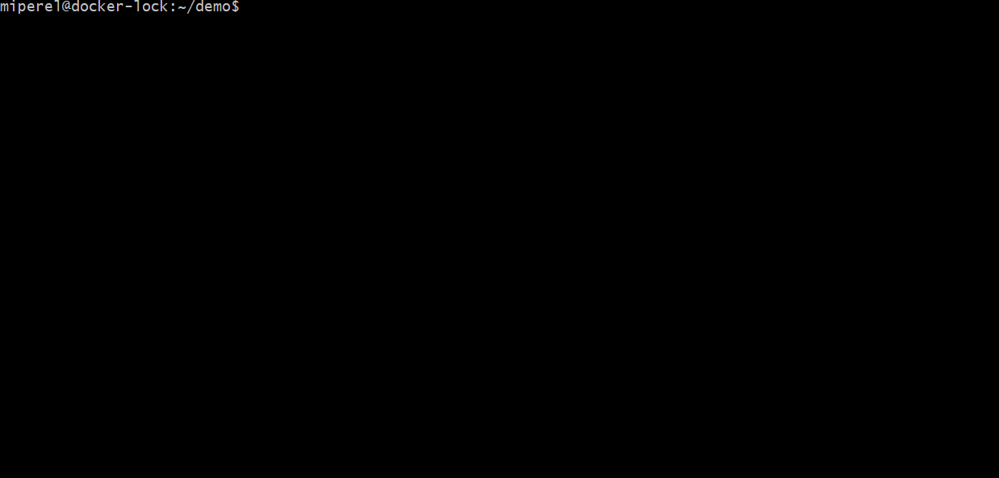

# About
[](https://dev.azure.com/michaelsethperel/docker-lock/_build/latest?definitionId=4&branchName=master)

`docker-lock` is a [cli-plugin](https://github.com/docker/cli/issues/1534) that uses lockfiles (think `package-lock.json` or `Pipfile.lock`) to ensure repeatable builds. `docker-lock` allows developers to refer to images by tags, yet still receive all the benefits of referring to images by digest.

If you do not understand the differences between tags and digests, please refer to the [Motivation](#Motivation) section of this README.

# How to use
`docker-lock` ships with two commmands `generate` and `verify`:
* `docker lock generate` generates a lockfile.
* `docker lock rewrite` rewrites base images in Dockerfiles and docker-compose files to use their digests.
* `docker lock verify` verifies that the lockfile digests are the same as the ones on a remote registry.

# Install
## Linux / Mac
* Docker version >= 19.03
* `mkdir -p ~/.docker/cli-plugins`
* `wget  -O docker-lock https://github.com/michaelperel/docker-lock/releases/download/{VERSION}/docker-lock-{OS}`
* `chmod +x docker-lock`
* `mv docker-lock ~/.docker/cli-plugins`
## Windows
* Docker version >= 19.03
* Create the folder `%USERPROFILE%\.docker\cli-plugins`
* Download `docker-lock-windows.exe` from the releases page.
* Rename the file `docker-lock.exe`
* Move `docker-lock.exe` into `%USERPROFILE%\.docker\cli-plugins`

## Demo
Consider a project with a multi-stage build Dockerfile at its root:
```
FROM ubuntu AS base
# ...
FROM mperel/log:v1
# ...
FROM python:3.6
# ...
```
Running `docker lock generate` from the root queries each images' registry to produce a lockfile, `docker-lock.json`.


Note that the lockfile records image digests. Running `docker lock verify` ensures that the image digests are the same as those on the registry for the same tags.

Now, assume that a change to `mperel/log:v1` has been pushed to the registry. Running `docker lock verify` shows that the image digest in the lockfile is out of date because it differs from the newer image's digest on the registry.



# Use cases
## CI/CD
`docker lock` can be used in CI/CD pipelines to ensure that the images used at build/test time are the same as the ones that will be deployed.
Consider the following CI/CD pipeline:
```
docker lock generate
docker lock rewrite
# build images
# run tests
# if tests pass, deploy
```
`docker lock generate` generates a lockfile that `docker lock rewrite` uses to rewrite Dockerfiles and docker-compose files
to use their digests rather than their tags. This mitigates the risk that an update is pushed to an image in between building
images and deploying them. If deploying to a Kubernetes or OpenShift cluster, [specifying digests will ensure repeatable builds](https://kubernetes.io/docs/concepts/configuration/overview/#container-images), regardless of `imagePullPolicy`.

## Development
While developing, it can be useful to generate a lockfile, commit it to source control, and verify it periodically (for instance on PR merges). In this way, developers can be notified when base images change, and if a bug related to a change in a base image crops up, it will be easy to identify.

To generate a lockfile, run:

`docker lock generate`

To verify a lockfile, run:

`docker lock verify`

# Motivation
Docker image tags are mutable. This means an image maintainer can push changes to an image without changing the tag. For instance, consider the `python:3.6` image hosted on Dockerhub. Recently, its maintainers changed the underlying linux distribution and pushed the updated image to Dockerhub with the same tag.

Mutable image tags are particularly useful for receiving updates. However, they jeopardize repeatable builds. An update to an image that an application builds upon could break the application, even if the application code does not change.

Image tags are by far the most common way to refer to an image. However, an image can also be identified by its digest, a unique hash that always refers to the same image. For instance, at the time of writing this README, the current `python:3.6` image could also be specified with the name and digest `python@sha256:25a189a536ae4d7c77dd5d0929da73057b85555d6b6f8a66bfbcc1a7a7de094b`. If the `3.6` tag receives an update, the digest would still refer to the older image.

Although specifying digests ensures that updates to a base image will not break the application, doing so comes with a host of problems. Namely:
* The application will no longer benefit from updates (security updates, performance updates, etc.).
* Dockerfiles will become stale.
* Digests are considerably less readable.
* It is unclear why an image is tied to a specific digest. Is it because future changes are incompatible, is it just to be safe, or does the developer prefer the digest over the tag?
* Keeping digests up to date can become unwieldly in projects with many services.
* Specifying the correct digest is complicated. Local digests may differ from remote digests, and there are many different types of digests (manifest digests, layer digests, etc.)

# Features
* Supports docker-compose (including build args, .env, etc.).
* Supports private images on Dockerhub, via the standard `docker login` command or via environment variables.
* Has CLI flags for common tasks such as selecting Dockerfiles/docker-compose files by globs.
* Smart defaults such as including `Dockerfile`, `docker-compose.yml` and `docker-compose.yaml` without configuration during generation so typically there is no need to learn any CLI flags.
* Lightning fast - uses goroutine's to process files/make http calls concurrently.
* Supports registries compliant with the [Docker Registry HTTP API V2](https://docs.docker.com/registry/spec/api/).
