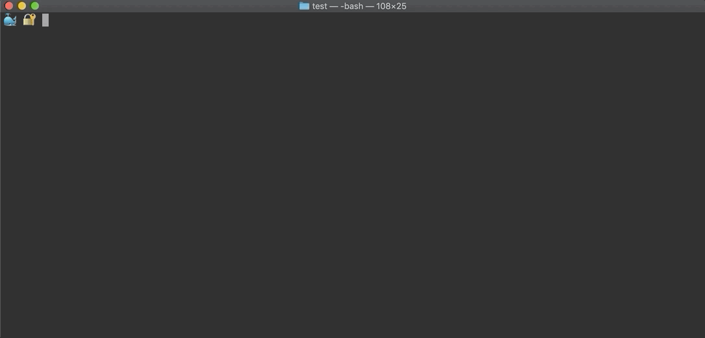

# About


[](https://goreportcard.com/report/github.com/safe-waters/docker-lock)
[](https://pkg.go.dev/github.com/safe-waters/docker-lock)

`docker-lock` is a cli tool that automates managing image digests by tracking
them in a separate Lockfile (think package-lock.json or Pipfile.lock). With
`docker-lock`, you can refer to images in **Dockerfiles**,
**docker-compose V3 files**, and **Kubernetes manifests** by
mutable tags (as in `python:3.6`) yet receive the same 
benefits as if you had specified immutable digests (as in `python:3.6@sha256:25a189a536ae4d7c77dd5d0929da73057b85555d6b6f8a66bfbcc1a7a7de094b`).

> Note: If you are unsure about the differences between tags and digests,
refer to this [quick summary](./docs/tutorials/tags-vs-digests.md).

`docker-lock` ships with 3 commands that take you from development 
to production:

* `docker lock generate` finds images in your `Dockerfiles`,
`docker-compose` files, and `Kubernetes` manifests and generates
a Lockfile containing digests that correspond to their tags.
* `docker lock verify` lets you know if there are more recent digests 
than those last recorded in the Lockfile.
* `docker lock rewrite` rewrites `Dockerfiles`, `docker-compose` files,
and `Kubernetes` manifests to include digests.

`docker-lock` ships with support for [Docker Hub](https://hub.docker.com/),
[Azure Container Registry](https://azure.microsoft.com/en-us/services/container-registry/),
[internal registries](https://docs.docker.com/registry/deploying/),
and a variety of other registries. If your registry is not supported
out of the box, do not worry. `docker-lock` was designed to be
[easily extensible](./docs/tutorials/bring-your-own-registry.md) to any
container registry.

`docker-lock` is most commonly used as a
[cli-plugin](https://github.com/docker/cli/issues/1534) for `docker` so `lock`
can be used as subcommand of `docker` as in `docker lock`. However,
`docker-lock` does not require `docker` at all. Instead, it can be called
manually as a standalone executable as in `docker-lock lock`. 
This is especially convenient if the proper version of `docker` is unavailable
or you would prefer to use another container technology such as
[podman](https://podman.io/).

# Demo
Consider a project with a multi-stage build `Dockerfile` at its root:
```Dockerfile
FROM ubuntu AS base
# ...
FROM mperel/log:v1
# ...
FROM python:3.6
# ...
```
Running `docker lock generate` from the root queries each images' 
registry to produce a Lockfile, `docker-lock.json`.



Note that the Lockfile records image digests so you do not have to 
manually specify them.

Running `docker lock verify` ensures that the image digests are the 
same as those on the registry for the same tags.


Now, assume that a change to `mperel/log:v1` has been pushed to the registry.

Running `docker lock verify` shows that the image digest in the Lockfile 
is out-of-date because it differs from the newer image's digest on the registry.


While developing, it can be useful to generate a Lockfile, commit it to 
source control, and verify it periodically (for instance on PR merges). In 
this way, developers can be notified when images change, and if a bug related 
to a change in an image crops up, it will be easy to identify.

Finally, lets assume the `Dockerfile` is ready to be built and shared.

Running `docker lock rewrite` will add digests from the Lockfile 
to all of the images.


At this point, the `Dockerfile` will contain all of the digest information 
from the Lockfile, so it will always maintain the same, known behavior 
in the future.

# Install
`docker-lock` can be run as a
* [cli-plugin](https://github.com/docker/cli/issues/1534) for `docker`
* standalone executable without `docker`
* prebuilt [image from Dockerhub](https://hub.docker.com/repository/docker/safewaters/docker-lock)

## Cli-plugin
Ensure `docker` cli version >= 19.03 is installed by running `docker --version`.

### Linux / Mac
```bash
$ mkdir -p "${HOME}/.docker/cli-plugins"
$ curl -fsSL "https://github.com/safe-waters/docker-lock/releases/download/v${VERSION}/docker-lock_${VERSION}_${OS}_${ARCH}.tar.gz" | tar -xz -C "${HOME}/.docker/cli-plugins"
$ chmod +x "${HOME}/.docker/cli-plugins/docker-lock"
```

### Windows
* Create the folder `%USERPROFILE%\.docker\cli-plugins`
* Download the Windows release from the releases page.
* Unzip the release.
* Move `docker-lock.exe` into `%USERPROFILE%\.docker\cli-plugins`

## Standalone tool
* Follow the same instructions as in the
[cli-plugin section](#cli-plugin) except place the `docker-lock` executable in
your `PATH`.
* To use `docker-lock`, replace any `docker` command such as `docker lock` with
the name of the executable, `docker-lock`, as in `docker-lock lock`.
* To verify that `docker-lock` was installed, run:
```bash
$ docker-lock lock --help
```

## Docker image
* `docker-lock` can be run in a `docker` container, as below. If you leave off
the `${VERSION}` tag, you will use the latest, nightly build from the master branch.
> Note: If your host machine uses a credential helper such as `osxkeychain`,
> `wincred`, or `pass`, the credentials will not be available to the container even
> if you pass in your `docker` config.

### Linux / Mac
* Without your `docker` config:
```bash
$ docker run -v "${PWD}":/run safewaters/docker-lock:${VERSION} [commands]
```
* With your `docker` config:
```bash
$ docker run -v "${HOME}/.docker/config.json":/.docker/config.json:ro -v "${PWD}":/run safewaters/docker-lock:${VERSION} [commands]
```
### Windows
* Without your `docker` config:
```bash
$ docker run -v "%cd%":/run safewaters/docker-lock:${VERSION} [commands]
```
* With your `docker` config:
```bash
$ docker run -v "%USERPROFILE%\.docker\config.json":/.docker/config.json:ro -v "%cd%":/run safewaters/docker-lock:${VERSION} [commands]
```

# Use
## Command line flags
`docker-lock` supports a variety of command line flags to customize behavior.

For instance, by default, `docker-lock` looks for files named `Dockerfile`,
`docker-compose.yaml`, `docker-compose.yml`, `pod.yml`, `pod.yaml`,
`deployment.yml`, `deployment.yaml`, `job.yml`, and `job.yaml` in the directory
from which the command is run. However, you may want `docker-lock` to find all
`Dockerfiles` in your project.

To do so, you could specify the command line flag, `--dockerfile-recursive`,
to the `generate` command as in:

```bash
$ docker lock generate --dockerfile-recursive
```

To see available command line flags, run commands with `--help`. For instance:

```bash
$ docker lock --help
$ docker lock generate --help
$ docker lock verify --help
$ docker lock rewrite --help
$ docker lock version --help
```

## Configuration File
Instead of specifying command line flags, you can specify flags in a
configuration file, `.docker-lock.yml`, in the directory from which the
command will be run. The root of this repo has an example,
[.docker-lock.yml.example](./.docker-lock.example.yml).

## Registries
`docker-lock` can use credentials from `${HOME}/.docker/config.json` to
retrieve digests from private repositories. It supports credential helpers
such as `wincred`, `osxkeychain`, and `pass`, so it should work in most cases.

As a fallback, you can specify auth credentials as environment variables.

### Dockerhub
Login:
```bash
$ docker login --username "${DOCKERHUB_USERNAME}" --password "${DOCKERHUB_PASSWORD}"
```

Run `docker-lock`:
```bash
$ docker lock generate
```

If this fails, specify credentials in a `.env` file in the directory from
which the command will be run (this location can also be specified with the
flag `--env-file`):
```
DOCKER_USERNAME=<your docker username>
DOCKER_PASSWORD=<your docker password>
```

or export those same variables:
```bash
$ export DOCKER_USERNAME=<your docker username>
$ export DOCKER_PASSWORD=<your docker password>
```

Run `docker-lock`:
```bash
$ docker lock generate
```

### Azure Container Registry
Login:
```
$ docker login --username "${ACR_USERNAME}" --password "${ACR_PASSWORD}" "${ACR_REGISTRY_NAME}.azurecr.io"
```
> Note: `az acr login` is not yet supported

Either specify the `ACR_REGISTRY_NAME` in a `.env` file or as an exported
environment variable:
```bash
ACR_REGISTRY_NAME=<your registry name>
```

or
```bash
$ export ACR_REGISTRY_NAME=<your registry name>
```

Run `docker-lock`:
```bash
$ docker lock generate
```

If this fails, specify your credentials in a `.env` file or as exported
environment variables, as in the [Dockerhub example](#Dockerhub).

### Other registries
Currently, `docker-lock` also supports Microsoft Container Registry and the
Elastic Search registry. These will just work -- no extra
configuration is required.

If you would like to add support for your own registry, see
[Bring Your Own Registry](./docs/tutorials/bring-your-own-registry.md).

If you would like to use an internal registry, see
[Using Internal Registries](./docs/tutorials/internal-registry.md).

# Contributing
## Development Environment
A development container based on `ubuntu:bionic` has been provided,
so ensure `docker` is installed and the `docker` daemon is running.

* Open the project in [VSCode](https://code.visualstudio.com/).
* Install VSCode's [Remote Development Extension - Containers](https://marketplace.visualstudio.com/items?itemName=ms-vscode-remote.vscode-remote-extensionpack).
* In the command palette (ctrl+shift+p on Windows/Linux,
command+shift+p on Mac), type "Reopen in Container".
* In the command palette type: "Go: Install/Update Tools" and select all.
* When all tools are finished installing, in the command palette type:
"Developer: Reload Window".
* The `docker` daemon is mapped from the host into the dev container,
so you can use `docker` and `docker-compose` commands from within the container
as if they were run on the host.

## Build From Source
To build and install `docker-lock` in `docker`'s cli-plugins directory,
from the root of the project, run:

```bash
$ make install
```

If you would like to cross-compile for another operating system
or architecture, from the root of the project, run:

```bash
$ CGO_ENABLED=0 GOOS=<your os> GOARCH=<your arch> go build ./cmd/docker-lock
```

## Code Quality and Correctness
To clean, format, lint, and run unit tests:
```bash
make
```

The CI pipeline will additionally run integration tests on pull requests.

You can run any step individually.

* To uninstall: `make clean`
* To install into `docker`'s cli-plugins directory: `make install`
* To format Go code: `make format`
* To lint all code: `make lint`
* To run unit tests: `make unittest`

To view the coverage report after running unit tests, open `coverage.html` in
your browser.

>Note: While there exists a target in the Makefile for integration tests, these
cannot run locally because they require credentials that are only available in
the CI pipeline.

# Tutorials
* [Tags Vs. Digests](./docs/tutorials/tags-vs-digests.md)
